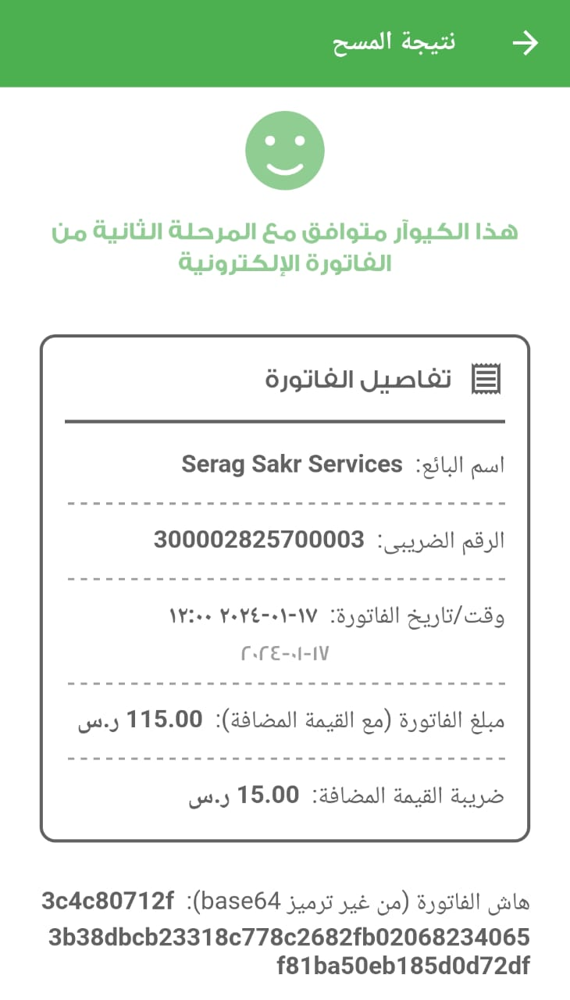

## Zatca e-invoice (fatoora) Phase 2 QR code generator in Flutter


This package strictly follows the guidelines provided by the Zatca authority to generate a simplified e-invoice (fatoora) QR code to print into the Bill/invoice of your business.

For more info kindly visit the official [Zatca Docs.](https://zatca.gov.sa/en/E-Invoicing/Pages/default.aspx)

## Features

- Simple QR code
- Simple QR code generator
- Generate QR code from Zatca QR data model
 

## Usage

For full example of the code, kindly have a look here [example](https://pub.dev/packages/zatca_2_invoice_generator/example) folder.

# Code result


# Scan result


### Initialize zacta in main.dart:

```dart
       void main() {
  initZacta();
  runApp(MyApp());
}

void initZacta() {
  ZatcaManager.instance.initializeZacta(
    sellerName: ZatcaConstants.companyName,
    sellerTRN: ZatcaConstants.taxRegistrationNumber,
    privateKeyBase64: ZatcaConstants.privateKeyBase64,
    certificateBase64: ZatcaConstants.certificateBase64,
    supplier: Supplier(
      companyID: ZatcaConstants.commercialRegistrationNumber,
      registrationName: ZatcaConstants.taxRegistrationNumber,
      address: Address(
        streetName: ZatcaConstants.street,
        buildingNumber: ZatcaConstants.buildingNumber,
        citySubdivisionName: ZatcaConstants.area,
        cityName: ZatcaConstants.cityName,
        postalZone: ZatcaConstants.postalZone,
      ),
    ),
  );
}
```
###   QR code Data Model:
# note: for B2B Invoices 
```dart

final qrDataModel = ZatcaManager.instance.generateZatcaQrInit(
    totalVat: "45.0",
    totalWithVat: "300.0",
    issueDate: "2024-01-17",
    issueTime: "05:41:08",
    invoiceUUid: "8e6000cf-1a98-4174-b3e7-b5d5954bc10d",
    invoiceNumber: "INV0001",
    invoiceLines: [
      InvoiceLine(
        id: '1',
        quantity: '10',
        unitCode: 'PCE',
        lineExtensionAmount: '100.00',
        itemName: 'Item 1',
        taxPercent: '15',
      ),
      InvoiceLine(
        id: '2',
        quantity: '1',
        unitCode: 'PCE',
        lineExtensionAmount: '200.00',
        itemName: 'Item 1',
        taxPercent: '15',
      ),
    ],
    invoiceType: ZatcaConstants.invoiceType,
    invoiceRelationType: InvoiceRelationType.b2b,
    customer: Customer(
      companyID: ' serag sakr ',
      registrationName: ' 87978',
      address: Address(
        streetName: ' ',
        buildingNumber: ' ',
        citySubdivisionName: ' ',
        cityName: 'Alexandria ',
        postalZone: ' ',
        countryCode: ' ',
      ),
    )
);

```
# note: for B2C Invoices 
```dart
        final qrDataModel = ZatcaManager.instance.generateZatcaQrInit(
    totalVat: "45.0",
    totalWithVat: "300.0",
    issueDate: "2024-01-17",
    issueTime: "05:41:08",
    invoiceUUid: "8e6000cf-1a98-4174-b3e7-b5d5954bc10d",
    invoiceNumber: "INV0001",
    invoiceLines: [
      InvoiceLine(
        id: '1',
        quantity: '10',
        unitCode: 'PCE',
        lineExtensionAmount: '100.00',
        itemName: 'Item 1',
        taxPercent: '15',
      ),
      InvoiceLine(
        id: '2',
        quantity: '1',
        unitCode: 'PCE',
        lineExtensionAmount: '200.00',
        itemName: 'Item 1',
        taxPercent: '15',
      ),
    ],
    invoiceType: ZatcaConstants.invoiceType,
  
  
  );
```
### Simple QR code:

```dart
       Center(
          child: Zatca2InvoiceQrGenerator(qrDataModel: qrDataModel),
        )
```


#### - Thanks for visiting here, hope you find this package useful if so then don't forget to give a like and star into the repo. Have a Bugs-free day 😉👨‍💻
